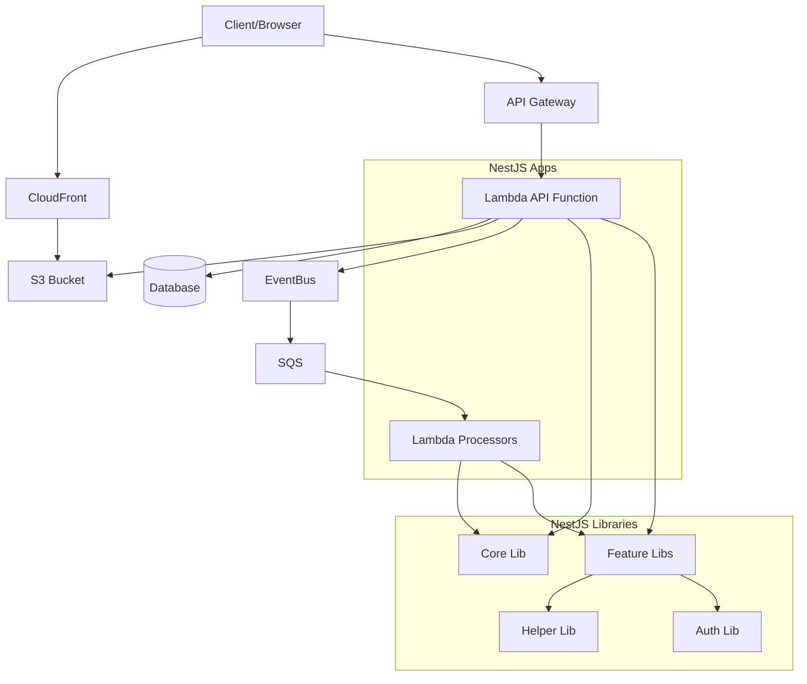
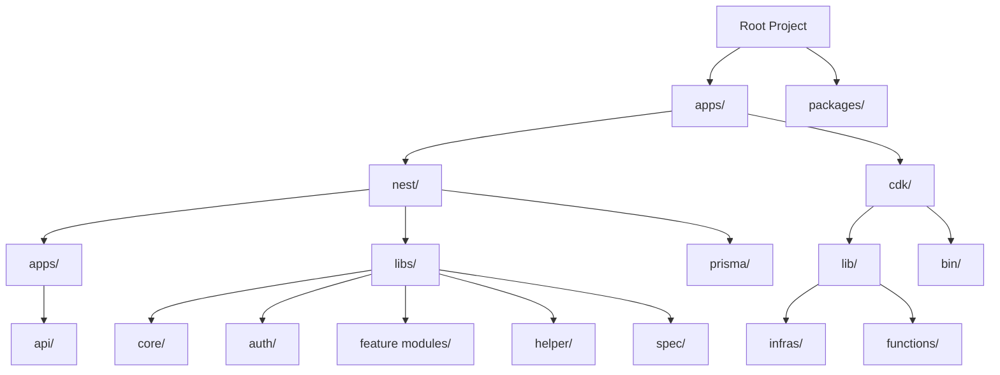
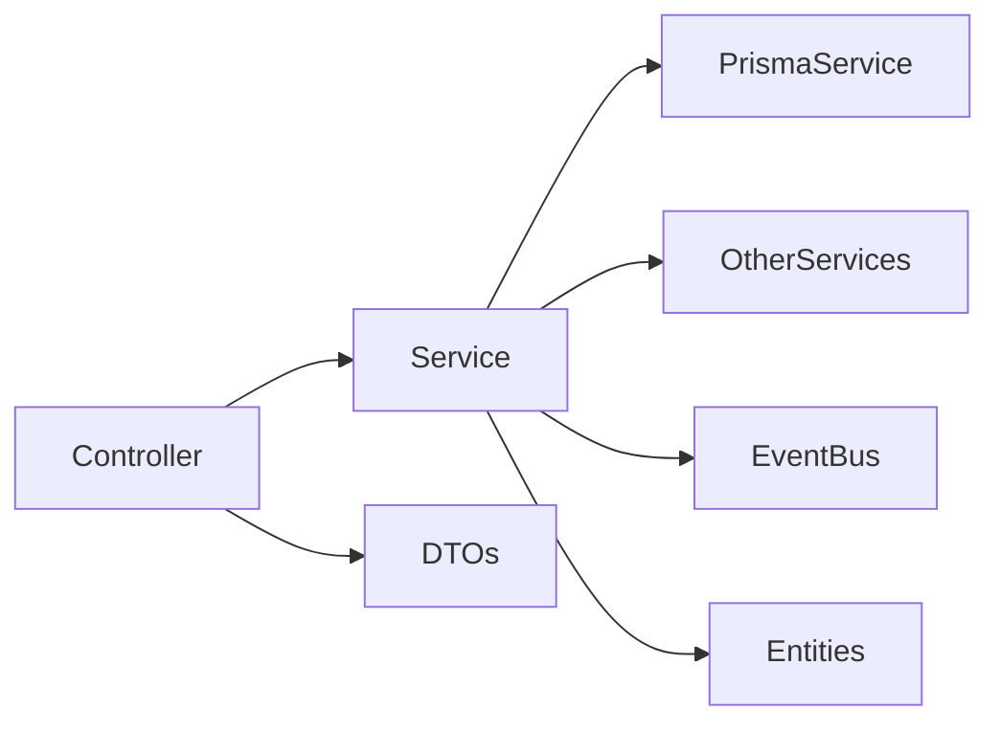

# System Patterns

## Architecture Overview

### Serverless Architecture


### Monorepo Structure


## Design Patterns

### NestJS Application
1. **Modular Architecture**
   - Feature-based modules (auth, todo, profile, etc.)
   - Each module in separate library
   - Clear separation of concerns
   - Core shared functionality

2. **Dependency Injection**
   - Service injection via constructors
   - Configuration injection
   - Cross-cutting concerns via interceptors and filters

3. **Repository Pattern via Prisma**
   - Data access abstraction through Prisma
   - Type-safe database operations
   - Service layer interaction with Prisma

4. **DTO Pattern**
   - Input validation with class-validator
   - Type safety with TypeScript
   - Swagger documentation with decorators

5. **Event-Driven Architecture**
   - EventBus for asynchronous communication
   - SQS for message processing
   - Lambda functions for event handling

### Component Relationships



## Technical Decisions

### 1. Serverless Architecture
- **AWS Lambda**: Individual function deployment
  - API Lambda for HTTP endpoints
  - Processor Lambdas for background tasks
  - Layer for shared code
- **API Gateway**: HTTP interface
  - REST API endpoints
  - Proxy to Lambda functions
- **CloudFront + S3**: Static assets and file storage
  - Client-side assets
  - User-uploaded files

### 2. Database Access
- **Prisma ORM**
  - Type-safe database access
  - Schema migrations
  - Central schema definition
  - Connection management

### 3. Caching Strategy
- **Redis**
  - API response caching
  - Distributed cache
  - Cache invalidation through decorators

### 4. Infrastructure as Code
- **AWS CDK**
  - TypeScript-based infrastructure
  - Environment separation
  - Resource organization
  - CI/CD integration

## Code Organization

### NestJS Application Structure
```
nest/
├── apps/                           # Lambda function entry points
│   └── api/                        # API Gateway Lambda
│       ├── src/
│       │   ├── main.ts            # Lambda handler
│       │   └── api.module.ts      # Root module
├── libs/                           # Shared libraries
│   ├── core/                       # Core functionality
│   │   ├── interceptors/          # Global interceptors
│   │   ├── decorators/            # Custom decorators
│   │   ├── filters/               # Exception filters
│   │   └── pipes/                 # Custom pipes
│   ├── auth/                      # Authentication module
│   ├── helper/                    # Utility helpers
│   └── feature modules/           # Domain modules (todo, user, profile)
│       ├── src/
│       │   ├── entities/          # Response entities
│       │   ├── dtos/              # Request DTOs
│       │   ├── feature.controller.ts
│       │   ├── feature.service.ts
│       │   └── feature.module.ts
├── prisma/                        # Database schema and migrations
    ├── schema.prisma              # Database models
    └── migrations/                # Database migrations
```

### CDK Infrastructure Structure
```
cdk/
├── lib/
│   ├── infras/                    # Infrastructure components
│   │   ├── apigateway.ts          # API Gateway definition
│   │   ├── storage.ts             # S3 & CloudFront
│   │   └── _infra-base.ts         # Base infrastructure class
│   ├── functions/                 # Lambda function definitions
│   │   ├── api-function.ts        # API Lambda
│   │   └── _function-base.ts      # Base function class
│   └── cdk-stack.ts               # Main stack definition
└── bin/
    └── config.ts                  # Environment configuration
```

## Best Practices

### 1. Error Handling
- Global exception filter (`AllExceptionsFilter`)
- Prisma exception filter (`PrismaClientExceptionFilter`)
- HTTP-friendly error responses
- Proper error logging

### 2. Validation
- DTO validation with class-validator
- Request validation with ValidationPipe
- Type transformation with class-transformer
- Custom pipes for parameter validation (ParseBigIntPipe)

### 3. Security
- JWT authentication (JwtGuard)
- User ownership validation in services
- CORS configuration
- Rate limiting through API Gateway

### 4. Performance
- Response caching with Redis
- Custom AppCacheInterceptor
- Cache key generation with AppCacheKey decorator
- Optimized Lambda bundling with custom webpack configs

### 5. API Documentation
- Swagger UI integration
- Entity and DTO documentation with decorators
- Operation descriptions
- Authentication documentation

### 6. Testing
- End-to-end tests with Jest
- Test helper utilities
- Environment isolation
- Profile-based testing 